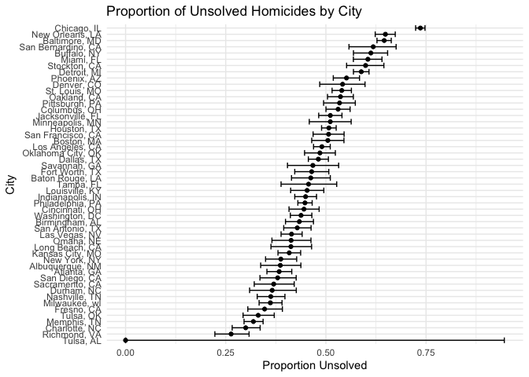
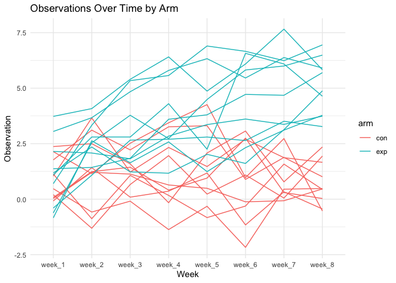
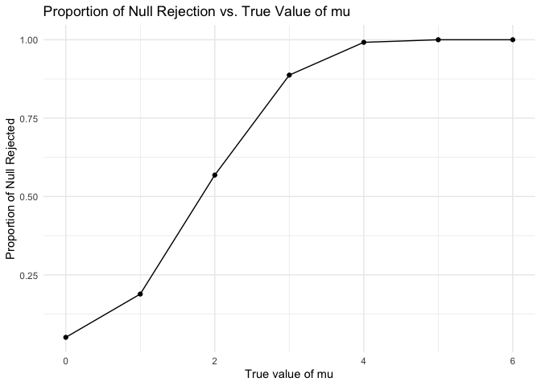
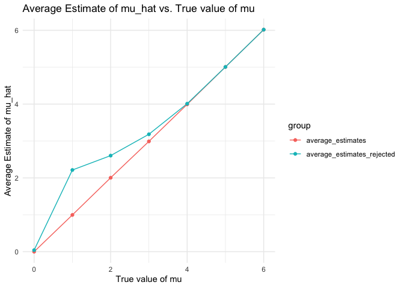

p8105_hw5_th3072
================

``` r
library(tidyverse)
```

    ## ── Attaching core tidyverse packages ──────────────────────── tidyverse 2.0.0 ──
    ## ✔ dplyr     1.1.3     ✔ readr     2.1.4
    ## ✔ forcats   1.0.0     ✔ stringr   1.5.0
    ## ✔ ggplot2   3.4.3     ✔ tibble    3.2.1
    ## ✔ lubridate 1.9.2     ✔ tidyr     1.3.0
    ## ✔ purrr     1.0.2     
    ## ── Conflicts ────────────────────────────────────────── tidyverse_conflicts() ──
    ## ✖ dplyr::filter() masks stats::filter()
    ## ✖ dplyr::lag()    masks stats::lag()
    ## ℹ Use the conflicted package (<http://conflicted.r-lib.org/>) to force all conflicts to become errors

``` r
library(ggplot2)

library(rvest)
```

    ## 
    ## Attaching package: 'rvest'
    ## 
    ## The following object is masked from 'package:readr':
    ## 
    ##     guess_encoding

``` r
library(purrr)
library(broom)
set.seed(1)
```

# Problem 1

``` r
homicides <- read_csv("./hw5_data/homicide-data.csv")
```

    ## Rows: 52179 Columns: 12
    ## ── Column specification ────────────────────────────────────────────────────────
    ## Delimiter: ","
    ## chr (9): uid, victim_last, victim_first, victim_race, victim_age, victim_sex...
    ## dbl (3): reported_date, lat, lon
    ## 
    ## ℹ Use `spec()` to retrieve the full column specification for this data.
    ## ℹ Specify the column types or set `show_col_types = FALSE` to quiet this message.

``` r
homicides_city_state <- homicides |>
  mutate(city_state = paste(city, state, sep=", ")) |>
  group_by(city_state) |>
  summarize(
    total_homicides = n(),
    unsolved_homicides = sum(disposition %in% c("Closed without arrest", "Open/No arrest"))
  )


baltimore_data <- filter(homicides_city_state, city_state == "Baltimore, MD")

unsolved <- pull(baltimore_data, unsolved_homicides)
total <- pull(baltimore_data, total_homicides)

prop_test_baltimore <- prop.test(unsolved, total)|>
  broom::tidy()|>
  knitr::kable(digits = 3)
prop_test_baltimore
```

| estimate | statistic | p.value | parameter | conf.low | conf.high | method                                               | alternative |
|---------:|----------:|--------:|----------:|---------:|----------:|:-----------------------------------------------------|:------------|
|    0.646 |   239.011 |       0 |         1 |    0.628 |     0.663 | 1-sample proportions test with continuity correction | two.sided   |

``` r
homicides_summary <- homicides |>
  mutate(city_state = paste(city, state, sep=", ")) |>
  group_by(city_state) |>
  summarise(
    total = n(),
    unsolved = sum(disposition %in% c("Closed without arrest", "Open/No arrest")),
  ) |>
  mutate(
    prop_test = map2(unsolved, total, ~prop.test(.x, .y)),
    tidy_data = map(prop_test, ~tidy(.x))
  ) |>
  unnest(tidy_data)
```

    ## Warning: There was 1 warning in `mutate()`.
    ## ℹ In argument: `prop_test = map2(unsolved, total, ~prop.test(.x, .y))`.
    ## Caused by warning in `prop.test()`:
    ## ! Chi-squared approximation may be incorrect

``` r
ggplot(homicides_summary, aes(x = reorder(city_state, estimate), y = estimate)) +
  geom_point() +
  geom_errorbar(aes(ymin = conf.low, ymax = conf.high)) +
  coord_flip() +
  labs(title = "Proportion of Unsolved Homicides by City",
       x = "City",
       y = "Proportion Unsolved") +
  theme_minimal()
```

<!-- -->

# Problem 2

``` r
prob2_data <- list.files(path = "./hw5_data/prob2_data", full.names = TRUE)

data_list <- map(prob2_data, read.csv)
data_combine <- bind_rows(data_list, .id = "id")

data_combine <- data_combine |>
  mutate(
    arm = ifelse(str_detect(prob2_data, "con"), "con", "exp"),
    subject_id = str_extract(basename(prob2_data), "\\d+"),
    subject_id = str_c(arm, "_", subject_id)
  ) |>
  select(-id)
```

``` r
tidy_data <- data_combine |>
  pivot_longer(cols = starts_with("week"), 
               names_to = "week", 
               values_to = "observation")

ggplot(tidy_data, aes(x = week, y = observation, group = subject_id, color = arm)) +
  geom_line() +
  theme_minimal() +
  labs(title = "Observations Over Time by Arm", x = "Week", y = "Observation")
```

<!-- -->
*Answer: * In control arm, we can clearly see little change over time at
week1 and week8, althought there are some fluctuations. However, for the
experimental arm, it is about the same as the control arm at week1, but
gradually increases over time. Finally, the experimental arm has higher
values than control arm.

# Problem 3

``` r
n <- 30
sigma <- 5
mu_values <- 0:6
```

``` r
results <- data.frame()
for (mu in mu_values) {
  for (i in 1:5000) {
    sample_data <- rnorm(n, mean = mu, sd = sigma)
    test_result <- broom::tidy(t.test(sample_data, mu = 0))
    results <- rbind(results, c(mu, mean(sample_data), test_result$p.value, test_result$p.value < 0.05))
  }
}
colnames(results) <- c("mu", "mu_hat", "p_value", "reject_null")
```

``` r
proportions <- aggregate(reject_null ~ mu, data = results, mean)

ggplot(proportions, aes(x = mu, y = reject_null)) +
  geom_line() +
  geom_point() +
  labs(title = "Proportion of Null Rejection vs. True Value of mu",
       x = "True value of mu",
       y = "Proportion of Null Rejected") +
  theme_minimal()
```

<!-- -->
*Answer: * From this plot, we can see with mu increase, the proportion
of null rejected rejected increase. So, the larger the effect size, the
greater the power of the test to detect it. Also, there is a diminishing
return (if effect size greater enough, the proportion of null rejected
should be 1).

``` r
average_estimates <- aggregate(mu_hat ~ mu, data = results, mean)
average_estimates_rejected <- aggregate(mu_hat ~ mu, data = results[results$reject_null == TRUE, ], mean)

average_estimates$group <- "average_estimates"
average_estimates_rejected$group <- "average_estimates_rejected"
combined_data <- rbind(average_estimates, average_estimates_rejected)


ggplot(combined_data, aes(x = mu, y = mu_hat, color = group)) +
  geom_line() +
  geom_point() +
  labs(title = "Average Estimate of mu_hat vs. True value of mu",
       x = "True value of mu",
       y = "Average Estimate of mu_hat") +
  theme_minimal() 
```

<!-- -->
*Answer: *

The sample average of mu_hat across tests for which the null is rejected
is not approximately equal to the true value of mu. It is typically
higher, especially at lower values of mu, which may not accurately
reflect the true effect size. When the effect size is large enough, the
sample estimates are naturally closer to the true values.
